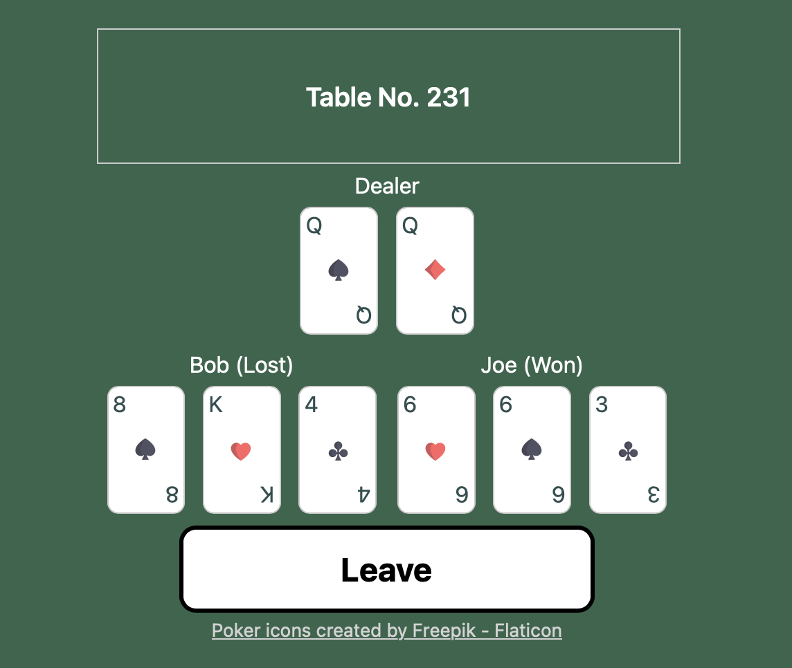

# Blackjack

Implementation of the popular casino game Blackjack, inspired by an exercise from [Gophericises](https://gophercises.com).

## Preview



## Prerequisites

* [just](https://github.com/casey/just) 1.40.0
* Go 1.23
* Node.js 22.9.0
* npm 10.8.3
* [Protocol Buffer Compiler](https://github.com/protocolbuffers/protobuf/releases) 25.3

## Architecture

Project consists of separate backend and frontend.

Backend is written in Go with net/http package. I did not go for more sophisticated solutions like Gin or Chi cause I wanted to follow Go's principle of using minimal dependencies. API has two variants: REST and gRPC. This is obviously wouldn't make a lot of sense in a real-world scenario. However I treat this project as a sandbox to learn and test new ideas. It is worth noting that as of now only the REST variant is integrated with frontend.

Frontend is written in Typescript using React. I used Vite (6.2.2) to set up the project.

## Running locally

First run `just setup` to install necessary packages.

### Backend

To start the backend service run

```
just build_api && just run_api_dev
```

Alternatively you can use Docker

```
just build_api_image && just run_api_image
```

### Frontend

To start the frontend run

```
just build_ui && just run_ui dev
```

If you want to preview the production build run

```
just build_ui && just run_ui preview
```

### Validation

To run tests run `just test`.

To format the code run `just fmt_fix`.

To lint the code run `just lint`.


